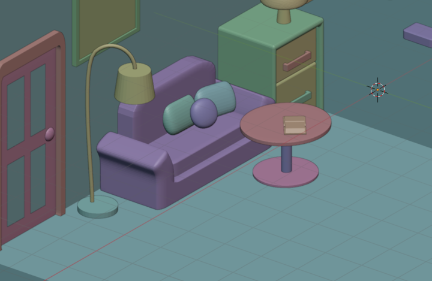

# Room

## Hour 1:

Did a sketch of what I want to make to come back and refrence

### Progress:

 added forgotten image

## Hour 2:

Started working on the blocking for the room.

### Progress:

## Hour 3:

Made 2 doores, window frame, ladder and finished blocking room

### Progress:

## Hour 4:

Made more shelves, a pot plant, alot of books, a set of drawers and a seat.

### Progress:

## Hour 5:

Made a shelf, globe, bed, pillows and started a lamp

### Progress:

## Hour 6:

Finished the lamp, made a table, a ladder, bricked a feature wall, made another lamp and picture frame and photo.

### Progress:

## Hour 7:

Made a lamp, couch and two shoes

### Progress:

## Hour 8:

Made pillows, open book, pen, paper and a plant

### Progress:

## Hour 9:

Made string lights, stack of books, vinyl records and their holder and started a guitar.

### Progress:

## Hour 10:

Finishd guitar, made a holder for it and then started a plant

### Progress:

