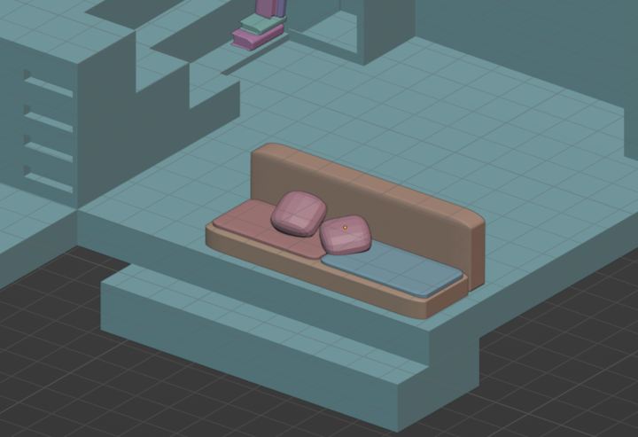
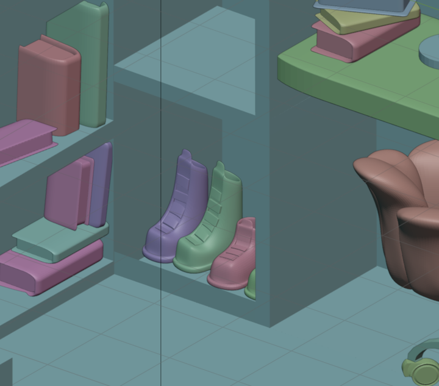
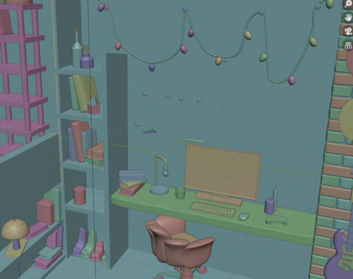
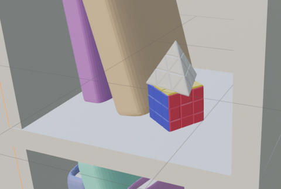
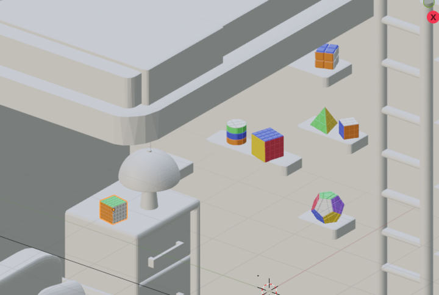

# Room
Wanted to create a intersting/house room design. It was interesting turning something that I drew/imagined into a physical 3d model in which things would actually line up which I didn't expect having to overcome.

## Sketchfab:
https://skfb.ly/p7ZRv

## Video Walkthrough:

  
See Progress Here:

## Hour 1:

Did a sketch of what I want to make to come back and refrence

### Progress:

 added forgotten image

## Hour 2:

Started working on the blocking for the room.

### Progress:

## Hour 3:

Made 2 doores, window frame, ladder and finished blocking room

### Progress:

## Hour 4:

Made more shelves, a pot plant, alot of books, a set of drawers and a seat.

### Progress:

## Hour 5:

Made a shelf, globe, bed, pillows and started a lamp

### Progress:

## Hour 6:

Finished the lamp, made a table, a ladder, bricked a feature wall, made another lamp and picture frame and photo.

### Progress:

## Hour 7:

Made a lamp, couch and two shoes

### Progress:

## Hour 8:

Made pillows, open book, pen, paper and a plant

### Progress:

## Hour 9:

Made string lights, stack of books, vinyl records and their holder and started a guitar.

### Progress:

## Hour 10:

Finishd guitar, made a holder for it and then started a plant

### Progress:

## Hour 11:

Made lots of little elements including plant, sticky notes, paper, pin board. bock stack, monitor and lamp.

### Progress:

## Hour 12:

Finished the lamp and started ading lighting to the room, coloured the fairy lights. I also relized one of the plants is missing so I will try and get that back later.

### Progress:

## Hour 13:

Worked on an office chair, I picked one with an organic shape that I thought would fit the vibe. It is almost done but it still looks a bit off.

### Progress:

## Hour 14:

Made a keyboard, mouse and controller.

### Progress:

## Hour 15:

Made alot of little things, vases, candles, a mug and started making the rubik's cubes for the shelves.

### Progress:

## Hour 16:

Made lots of rubik's cubes for the shelves and made shoes to put in the bottom shelf.
LINK TO .blend FILE:
https://drive.google.com/file/d/1PHw9N8jgx8hE9j4ZOEclmSJnzTHccqoA/view?usp=drive_link 

### Progress:

## Hour 17:

Spent most of the hour decimating each individual objects so I can get the file size down. This was very time consuming and annoying but ended up being worth it. I went from around 110mb to 58mb. Then I just atarted adding more stuff to shelves.

## Progress:

## Hour 18:

Made a new light, crashed blender, started adding materials

## Progress:

## Hour 19:

Fixed some odd shadowing when rendering, fixed desk space, added materials to chair, monitor, pin board, pins, guitar.

## Progress:

## Hour 20:
Added lots of simple materials this session, did most of the desk area and alot of books

## Progress:

## Hour 21:
Added materials to corenr under the bed, did all the rubiks cubes.

## Progress:

## Hour 22: 

Kept adding materials, did bed couces, maps, books and shoes also added accent walls.

## Progress:

## Hour 23:

Finished off adding materials to all the current objects in the room I think. 

## Progress:

.png>)

